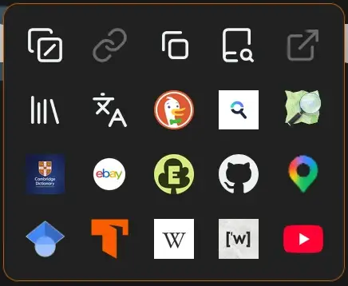
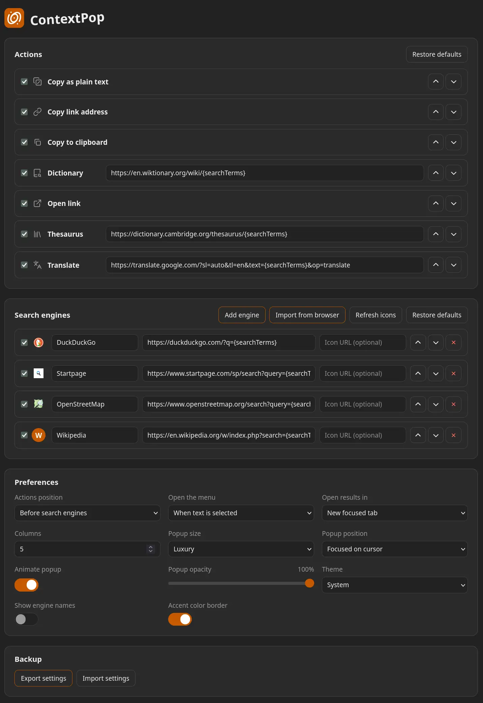

# ContextPop

Browser extension that launches a customizable popup on text selection for instant search, copy to clipboard, dictionary, thesaurus, and links.

Install: [Firefox ContextPop](https://addons.mozilla.org/en-GB/firefox/addon/contextpop/) + *Chrome coming soon*.




## Features

- Popup tile grid on text selection, keyboard navigable (arrows, Home/End, Tab, Escape)
- Built-in actions: copy (rich or plain), copy link address, open link, dictionary, thesaurus, and translate
- Search engines, with a configurable Actions-before/after-engines group order
- Context-aware actions: copy, copy link address, open link, dictionary, thesaurus, and translate apply to the selections they suit (`text`, `word`, `link`)
- Manage engines (name, template, optional icon); engines are offered for any selection
- Import the engines already installed in Firefox and search them through the browser
- Engine icons fetched from each engine's own site (or a custom icon URL), with a letter fallback
- Open results in a new tab, background tab, current tab, or new window; dictionary/thesaurus/translate open a popup window
- Configurable trigger: on selection or while holding Alt, Ctrl/Cmd, or Shift
- Popup controls: columns, size, position, opacity, animation, accent border, and engine-name labels
- Light, dark, or follow system theme;
- Export/import settings as JSON
- First-run orientation callout on the options page
- English, Spanish, German, French, and Hindi UI via `_locales`
- Firefox and Chrome, Manifest V3

## Install (temporary / unpacked)

### Firefox

1. Open `about:debugging#/runtime/this-firefox`.
2. Click **Load Temporary Add-on...**.
3. Select `src/manifest.json`.

### Chrome / Chromium

Chrome only reads a file named `manifest.json`, and `src/manifest.json` is the Firefox manifest. Use the packaging script to produce a ready-to-load directory:

```sh
./scripts/package.sh
```

Then:

1. Open `chrome://extensions`.
2. Enable **Developer mode**.
3. Click **Load unpacked** and select `dist/chrome`.
4. Re-run the script after changes, then click the reload button on the extension card.

## Package

Build zip archives for both stores:

```sh
./scripts/package.sh
```

Outputs `dist/contextpop-firefox.zip` and `dist/contextpop-chrome.zip`. The script uses `zip` when available and falls back to Python's `zipfile`. It also fails if the shared fields in the two manifests drift.

## Development

No install and no build. Dev tooling is the system `biome`, `lefthook`, `cog`, and `tsc` binaries:

```sh
biome check                    # lint + format check
biome check --write            # apply fixes
tsc --noEmit -p jsconfig.json  # type-check the JS
node --test test/*.test.js     # unit tests for shared/pure logic
lefthook install               # enable git hooks once per clone
cog bump --auto                # version + changelog; syncs both manifests
```

CI (`.github/workflows/ci.yml`) runs the same checks on push and pull requests, plus `web-ext lint` and `scripts/package.sh` (manifest-drift validation).

## Engine template

Each engine has a URL template containing `{searchTerms}`, for example:

```text
https://duckduckgo.com/?q={searchTerms}
```

`{searchTerms}` is replaced with the URL-encoded selected text. Templates must use `http` or `https`.

## Permissions and privacy

- `storage` — engines, actions, and preferences, kept on-device.
- `search` — enumerate and search the browser's installed engines (Firefox import/search; imported engines are hidden where the API is unavailable).
- `clipboardWrite` — copy actions.
- Host access to all sites — needed to show the menu wherever you select text and to fetch engine icons. It is granted at install (Firefox 127+ lists it in the install prompt; Chrome grants it), but users can revoke it and temporary/unpacked loads start without it. When it is missing, grant it from the onboarding callout or "Refresh icons" in settings. Revoke per-site in the browser's extension settings.

Remote icons are fetched by the background, preferring the high-resolution icon each site declares, and cached on-device without cookies or a referrer. Use "Refresh icons" in settings to re-fetch them. See [PRIVACY.md](PRIVACY.md).

## License

[GNU General Public License v3.0](LICENSE)
